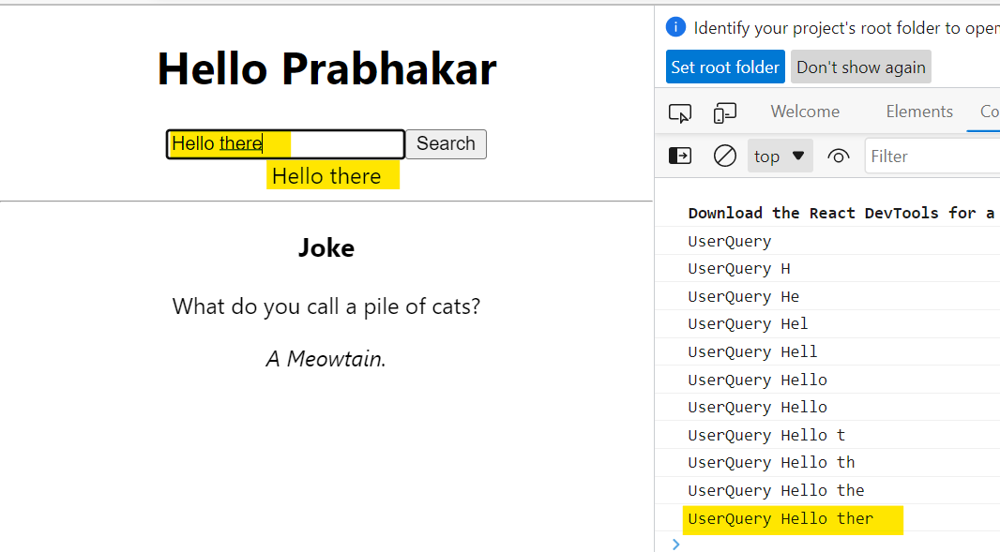

- [What is React runtime and how React applies Hooks?](#what-is-react-runtime-and-how-react-applies-hooks)
- [How does useState() works under the hood?](#how-does-usestate-works-under-the-hood)
- [Why React Hooks?](#why-react-hooks)
- [What is Diffing Algorithm?]()


***

### What is React runtime and how React applies Hooks?

**React is a runtime**
A system that continually outputs a tree of nodes.

**Construction of DOM Node**

```js
> const node = document.createElement('div');
< undefined

> node.innerText = 'hi';
< 'hi'

> node;
<    <div>hi</div>
```

createElement() returns an object that determines the document node by using the document core api provided by the browsers javascript environment.
Eventhough we are not writing this code, React Engine writes this for us. For example

Render 1

```js 
ReactDOM.render(<p>Hello</p>, document.getElementById('root'));
```
Under the hood its looks like this
```js
let rootDiv = document.getElementById('root');
let pNode = document.createElement('p');
pNode.innerText = "Hello";
rootDiv.appendChild(pNode);
```
At this point react is effectively working as syntactic sugar around the core DOM api.

```js
<div id='root'>
    <p>Hello</p>
</div>
```

Render 2.
Now say text is gonna change from Hello to Hello World

```js 
ReactDOM.render(<p>Hello World</p>, document.getElementById('root'));
```
There will be two approches that React runtime can check

Nuke and Create from Scratch
```js
let rootDiv = document.getElementById('root');
rootDiv.innerHTML = '';
let pNode = document.createElement('p');
pNode.innerText = "Hello World";
rootDiv.appendChild(pNode);
```
But the trouble with this approch is using the DOM api is expensive. we need to minimize the DOM operations.

so, React doesn't go with this process and goes with the process called Reconciliation.

**Reconciliation**
In this process React decides whether to create or update the node.

Reconciliation --> identify

Is the root div's child already has a `<p>` element? In our case Yes

```js
pNode.innerText = "Hello World";
```

Render 3:

```js 
ReactDOM.render(<form></form>, document.getElementById('root'));
```

Is the root div child already has a `<form>` elemement? In this case No

```js
rootDiv.removeChid(pNode);
let formNode = document.createElement('form');
rootDiv.appendChild(formNode);
```

*Make sure mapped elements have a 'key'!*

```js
list.map(item => <div key={item.id}> </div>)
```

**React Application Structure**

In React all components are functions. 

```js
let reactComponent = App();
ReactDOM.render(reactComponent,document.getElementById('root'));
```

But we know this is not the syntax that is used.

But you don't directly call the component function. Rather than you let the react engine call the component function for you. Instead of calling the App component function we specify the what the component to render.

You wite JSX
```js
ReactDOM.render(<App />,document.getElementById('root'));
```

This special syntax is recognized by the react engine and gives the react engine the power to call the component functions for you. Again with JSX we are not calling the component functions, instead we are specifying the syntax which handles the control to the react engine to call the component function on you behalf. So this is the programming principle of **Inversion of Control**

**Inversion of Control**

React can recursively call multiple message components.

Suppose we have
```js
<App>
    <Header />
</App>
```
Under the hood

*App();* Returns the a div with a Header component as its child

*Header();* Return a paragragh with an inner header1 element and some text

key takeaway here you are not in charge of calling component functions instead react itself is in charge of calling the component functions.

React is determinent which components needs to be rendered. To create the necessary DOM structure over the time. in additional to call the recursively call the component functions based on jsx structure, React can achieve other cool things with the control over your component. Since React is managing the components, it can argument each function component with cool features like 
-  Components with State
-  Components with Side Effects
***

### How does useState() works under the hood?

Consider we have this APP Jsx

```js
  const updateUserQuery = (event) => {
    setUserQuery(event.target.value);
    console.log('UserQuery',userQuery);
  }

   <div className='form'>
        <input value={userQuery} onKeyPress={handleKeyPress} onChange={updateUserQuery} />
        <button onClick={searchQuery}>Search</button>
        <div>{userQuery}</div>
   </div>
```

Ouput



If we observer the console, user query value seemd to be one behind whatever we was typed in the input. Also we could see the actual value displayed properly in the UI.

Let's investigate whats happening here

The update user query function is provided to the react through an unchanged handler as a callback function by referencing the name of the function itself.

```js
 <input value={userQuery} onChange={updateUserQuery} />
```

So the gist of the overall match between the log and the value is as a function. This callback has its own closure as a function with its own closure. The update user query method has its own scope with access to certain global and local variable, and these variables are defined at the time the callback function is created.

First we arrive at the setUserQuery() line. The key thing about this that the set user query line doesnt execute right away. Its asynchronous and non blocking. Its handled in the background within the react engine, ready to update the internal user query value and eventually recall a render.
At the same time it doesnt block rest of the update user query method from executing Javascript still makes into it to the console.log line. The log fires of and the user query at this time is blank string, so the console prints the blank initially.

Next React engine in due time will call the queue set user query function internally. The set function updates the user query value that React is internally keeping track of within the engine as relevant state for the component. Now the user query value becomes h, which is what user typed.  Internally React knows there is a state variable changed, it should retrigger the render of the component. so it recalls the app component that contains this input.

**The Order of useState()**

Consider the below example:
```js
import { useState } from "react";
import {v4 as uuidv4}  from 'uuid';

function Tasks()
{
    const [taskText, setTaskText] = useState('');
    const [tasks, setTasks] = useState([]);
    const [completedTasks, setCompletedTasks] = useState([]);

    const updateTaskText = event => {  setTaskText(event.target.value);  }
    const addTask = () => {  setTasks([...tasks, { taskText, id: uuidv4()}]);  }
    const completetask = completedTask => () => {
        setCompletedTasks([...completedTasks, completedTask]);
        setTasks(tasks.filter(x => x.id !== completedTask.id));
    }
    const deleteTask = task => () => { setCompletedTasks(completedTasks.filter(t => t.id !== task.id));  }

    return(
        <div>
            <h3>Tasks</h3>
            <div className="form">
                <input onChange={updateTaskText} value={taskText}/>
                <button onClick={addTask}>Add Task</button>
                <div className='task-list'>
                    {
                        tasks.map(task => {
                            const { id, taskText } = task;
                            return <div onClick={completetask(task)} key={id}>{taskText}</div>
                        })
                    }
                </div>
                <div className='completed-list'>
                    {
                        completedTasks.map(task => {
                            const { id, taskText } = task;
                            return (
                            <div key={id}>
                                {taskText}{' '}
                                <span onClick={deleteTask(task)}>x</span>
                            </div>)
                        })
                    }
                </div>

            </div>
        </div>
    )
}

export default Tasks;
```

in the above example we have three states for the component. Lets try to modify the code as below

```js
let i = 0;

function Tasks()
{
    const [taskText, setTaskText] = useState('');

    let tasks, setTasks, completedTasks, setCompletedTasks;

    if(i%2 == 0)
    {
        ([tasks, setTasks] = useState([]));
        ([completedTasks, setCompletedTasks] = useState([]));
    }
    else 
    {
        ([completedTasks, setCompletedTasks] = useState([]));
        ([tasks, setTasks] = useState([]));
    }

    i++;
    --------
    --------
}

export default Tasks;
```
In the above code we are trying to use the state conditionally based on the i values. Also we have changed the order in the else part. When we run this code we can see the state values shifting from completedtasks and tasks in UI. This is because React Hooks must be called in the exact same order.


suppose we have modified the code as below and it works as expected before. In the else part we are assigning them in the consistent call order even though we have different names.

```js
 if(i%2 == 0)
    {
        ([tasks, setTasks] = useState([]));
        ([completedTasks, setCompletedTasks] = useState([]));
    }
    else 
    {
        let [foo, setFoo] = useState([]);
        let [bar, setBar] = useState([]);
        tasks = foo;
        setTasks = setFoo;
        completedTasks = bar;
        setCompletedTasks = setBar;
    }
```

So, overall point is the naming you have've choosen within your state doesnt matter. Its the order in which we apply the hooks and call it within your function component

We can see the eslint error as below in the latest version

``React Hook "useState" is called conditionally. React Hooks must be called in the exact same order in every component render``

**Hooks with Interval**

consider we have image gallery component than can create a slideshow of pictures to transition in a interval.

```js
import React, { useEffect, useState } from 'react';
import PICTURES from './data/pictures';

function Gallery()
{
    const [index, setIndex] = useState(0);

    useEffect(() => {
        setInterval(() => {
            setIndex((index +1)%PICTURES.length)           
        }, 5000)
    }, []);

    console.log('Index', index)

    return (
    <div className='Gallery'>
        
    </div>)

}
export default Gallery;

```

In our useEffect we are firing off an interval which would do the relevant transition of the index and this interval goes for every 5seconds. Now we want this interval to be queued up once, so as a second argument to the use effect will supply an empty array.
To loop back the elements in the array we are using the modulus operation while setting the index if it reaches the maximum length.

If we keep track on the console logs, initial the index is 0 and from next time onwards the index is always 1. Its always incrementing from 0 to 1. Well, this is due to the fact that when we create a callback and set it to off to the react engine, under the hood the variables are already defined in the closure. So when we send the call back to increment the index initially that index variable is set 0. It gets a chance to increment the index to 1 on a re render.

Reacts provides alternative syntax for the setter function. And this alternative syntax forces to pull the latest stored value of the state variable.

```js
  useEffect(() => {
        setInterval(() => {
            setIndex((storedIndex) => (storedIndex +1)%PICTURES.length)           
        }, 5000)
    }, []);
```
So we have to use the alternate syntax for the setter function to make sure React always pulls the latest stored value in the internal React engine.

**Effects with Cleanup**

Consider our gallery application. Now we wanted to show this gallery based on the toggle button

```js
function App() 
{
  const [showGallery, setShowGallery] = useState(true);

  const toggleGallery = () => { setShowGallery(!showGallery); }

  return (
    <div className="App">
      <h1>Hello Prabhakar</h1>
      <hr/>
      <div>
        {showGallery ? <Gallery /> : null}
        <button onClick={toggleGallery}>{showGallery ? 'Hide': 'Show' } Gallery</button>
      </div>      
    </div>)
}
```

When we hide the gallery, the gallery component gets unmounted. But in the Gallery Component we have setInterval which tried to update the state

When we see the console we can see any warning as below

``Can't perform a React state update on an unmounted component. This is a no-op, but it indicates a memory leak in your application. To fix, cancel all subscriptions and asynchronous tasks in a useEffect cleanup function.``

The message is straightforward. We're trying to change the state of a component, even after it's been unmounted and unavailable.

So, if we want to cleanup interval, the code would look like this:

```js
    useEffect(() => {
        const intervalId = setInterval(() => {
            setIndex((storedIndex) => (storedIndex +1)%PICTURES.length)           
        }, 5000)
        return () => clearInterval(intervalId);
    }, []);
```

In the following example, we have an async function that performs some operation and while this is running I want render a “loading” message. Once the function finish I will change the state of “loading” and render another message.

```js
function Example(props) {
    const [loading, setloading] = useState(true)

    useEffect(() => {
        fetchAPI.then(() => {
            setloading(false)
        })
    }, [])

    return <div>{loading ? <p>loading...</p> : <p>Fetched!!</p>}</div>
}
```

But, if we exit the component and fetchAPI ends and sets the loading state, this will prompt the error mentioned. So we need to be sure that the component is still mounted when fetchAPI is finished.

```js
function Example(props) {
    const [loading, setloading] = useState(true)

    useEffect(() => {
        let mounted = true
        fetchAPI.then(() => {
            if (mounted) {
                setloading(false)
            }
        })

        return function cleanup() {
            mounted = false
        }
    }, [])

    return <div>{loading ? <p>loading...</p> : <p>Fetched!!</p>}</div>
}
```
This way we can ask if the component is still mounted. Just adding a variable that will change to false if we dismount.

*Cancel an Axios request*

Axios comes with a cancellation option to finish a request before it ends. This is useful besides the cleanup function to prevent memory leaking.

```js
useEffect(() => {
    const source = axios.CancelToken.source()

    const fetchUsers = async () => {
        try {
            await Axios.get('/users', {
                cancelToken: source.token,
            })
            // ...
        } catch (error) {
            if (Axios.isCancel(error)) {
            } else {
                throw error
            }
        }
    }

    fetchData()

    return () => {
        source.cancel()
    }
}, [])
```
***

### Why React Hooks?

React hooks were introduced in React 16.8 as a new way of writing reusable logic in functional components. Prior to hooks, the only way to add stateful behavior to a functional component was to convert it to a class component, which can lead to more complex code and may not be as intuitive for developers who are used to working with functions.

Here are some reasons why we need React hooks:

- Reusability: Hooks make it easier to reuse logic between components. With hooks, you can extract stateful logic from a component and reuse it across multiple components.

- Simplified code: Hooks make code more streamlined and easier to understand. Instead of writing complex class components, hooks allow you to write simpler, more concise functional components.

- Improved performance: Hooks can help optimize the performance of your application. Because hooks are more lightweight than class components, they can help reduce the overall memory footprint of your application.

- Better testing: Hooks make it easier to test your code. Since hooks are just functions, they can be tested in isolation without needing to render an entire component.

Overall, React hooks provide a more flexible and efficient way to manage state and lifecycle events in functional components. They allow developers to write cleaner and more maintainable code, making it easier to build and scale React applications.

***

### What is Diffing Algorithm?

React's reconciliation algorithm is based on a diffing algorithm, which takes two trees (the current and new virtual DOM) and calculates the minimum set of changes required to transform the current tree into the new one. The key idea behind the algorithm is to perform the comparison in linear time, O(n), rather than a worst-case scenario of O(n^3).

The algorithm makes two assumptions to achieve this:
- Two elements of different types will produce different trees.
- The developer can hint at which child elements may be stable across different renders by assigning a unique key prop to each child.

By relying on these assumptions, React can quickly identify the differences between the two trees and make the necessary updates.


